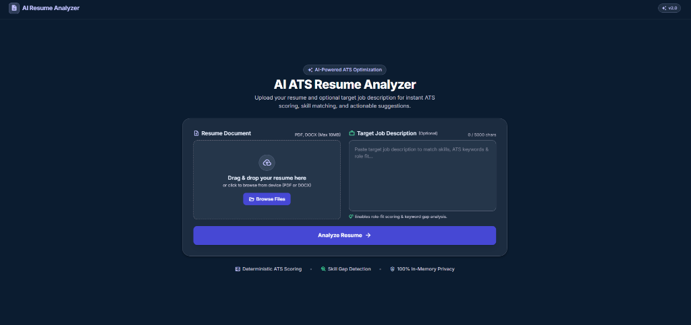
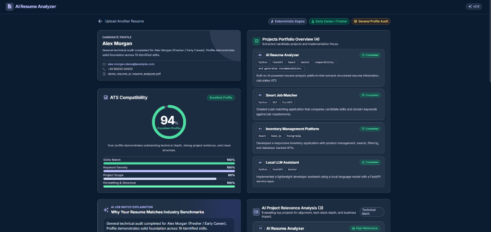
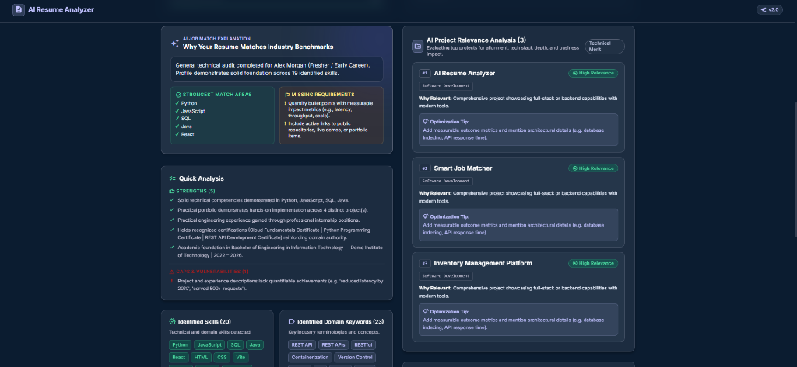
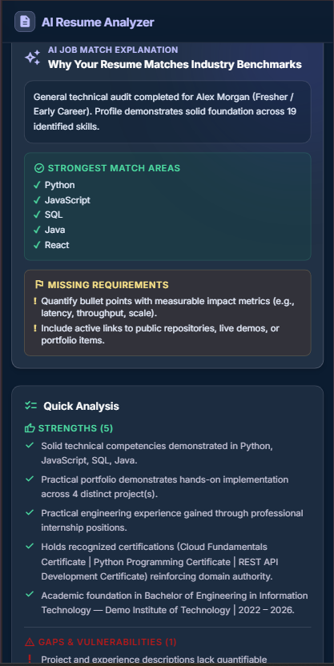

# AI Resume Analyzer

An intelligent, privacy-first web application for automated resume parsing, Job Description (JD) matching, deterministic ATS compatibility scoring, and actionable AI-driven optimization recommendations.

[](https://react.dev/)
[](https://fastapi.tiangolo.com/)
[](https://tailwindcss.com/)

---

## 📸 Screenshots

### Resume Analysis (Upload Interface)


### Results Dashboard (Overview & ATS Scoring)


### AI-Powered Analysis & Project Relevance


### Responsive Mobile View
<p align="center">
  
</p>

---

## 🚀 Quick Start

Get the application running locally in less than two minutes.

### 1. Backend Setup

```powershell
# Navigate to the backend directory
cd backend

# Create and activate a Python virtual environment (Windows PowerShell)
python -m venv .venv
.\.venv\Scripts\Activate.ps1

# Install dependencies
pip install -r requirements.txt

# Start the FastAPI server
uvicorn app.main:app --reload
```

- **Backend API**: `http://localhost:8000`
- **Health Check**: `http://localhost:8000/health`
- **Interactive Swagger Docs**: `http://localhost:8000/docs`

### 2. Frontend Setup

Open a second terminal window:

```powershell
# Navigate to the frontend directory
cd frontend

# Install Node dependencies
npm install

# Start Vite development server
npm run dev
```

- **Frontend Application**: `http://localhost:5173`

---

## ✨ Features

- **Document Ingestion & Text Extraction**:
  - Multi-page extraction and password detection for `.pdf` documents via `pypdf`.
  - Paragraph and table extraction for `.docx` documents via `python-docx`.
  - Automatic format validation, MIME type verification, and 10 MB size enforcement.
- **Document Content Validation**:
  - Deterministic signal scoring to verify the uploaded document is a genuine resume.
  - Rejects non-resume files (invoices, homework assignments, lab manuals) before analysis.
- **Semantic Section Segmentation**:
  - Resilient heading classification for standard and extended variations (e.g., *Core Competencies*, *Relevant Projects*, *Research & Publications*).
  - Strict boundary isolation preventing cross-contamination between sections.
- **Universal Project Portfolio Extraction**:
  - Generic boundary parsing for arbitrary project structures (`Title | Tech List`, `Title – Tech List`, `Title (Tech List)`, bullets, etc.).
  - Extracts and displays up to **10 projects** in the portfolio overview.
  - Context-aware ongoing project detection (e.g., explicit *(Ongoing)* or *In Progress* indicators).
- **Candidate Classification & Experience Isolation**:
  - Automatically classifies **Early Career / Fresher** vs. **Experienced Professional**.
  - Distinguishes **Professional Employment**, **Internships**, and **Virtual Job Simulations** (e.g., Forage / JPMorgan / Goldman Sachs).
  - Experience card is automatically hidden for freshers with no commercial background (no empty cards or "Experience: 0%").
- **Deterministic ATS Scoring (0–100)**:
  - Transparent mathematical scoring across skills, keyword overlap, project scope, education, and resume structure.
  - Adaptive candidate weighting: zero score penalty for freshers with no commercial experience.
- **Skill & Domain Keyword Gap Analysis**:
  - Technical alias and synonym resolution (e.g., *React.js* ↔ *React*, *K8s* ↔ *Kubernetes*, *Postgres* ↔ *PostgreSQL*).
  - Identifies matched skills and highlights missing requirements against target job descriptions.
  - Supports General Profile Audit mode when no job description is provided.
- **AI-Powered Insights & Recommendations**:
  - Multi-provider support (**Google Gemini** or **OpenAI**) with a deterministic offline fallback engine.
  - Deep job-match explanation highlighting strongest match areas and critical gaps.
  - Evaluates up to **3 top projects** for role relevance, tech stack depth, and business impact.
  - Actionable prioritized recommendations (High, Medium, Low) and ATS formatting tips.
- **Responsive Results Dashboard**:
  - Interactive two-page interface with circular ATS score gauge, candidate profile card, skills comparison, project portfolio with completed/ongoing filters, and collapsible raw extracted text.
  - Tailored layout for mobile, tablet, and desktop viewports.

---

## ⚙️ Environment Variables

### Backend Configuration (`backend/.env`)

Copy `backend/.env.example` to `backend/.env` to configure optional AI settings or feature flags:

```ini
# Allowed frontend CORS origins (comma-separated)
FRONTEND_ORIGINS=http://localhost:5173,http://127.0.0.1:5173,http://localhost:5174,http://127.0.0.1:5174

# AI Provider ("gemini" or "openai")
AI_PROVIDER=gemini
AI_API_KEY=
AI_MODEL=gemini-3.5-flash

# Modular Feature Toggles (True / False)
SHOW_ATS_SCORE=True
SHOW_SKILL_MATCH=True
SHOW_KEYWORD_ANALYSIS=True
SHOW_EXPERIENCE_ANALYSIS=True
SHOW_PROJECT_ANALYSIS=True
SHOW_AI_RECOMMENDATIONS=True
SHOW_RESUME_STRENGTHS=True
```

> **Note**: An AI API key is completely optional. When `AI_API_KEY` is not provided, the application runs offline using its built-in deterministic fallback engine.

### Frontend Configuration (`frontend/.env`)

Copy `frontend/.env.example` to `frontend/.env`:

```ini
# Backend API base URL (defaults to http://127.0.0.1:8000 if unset)
VITE_API_BASE_URL=http://127.0.0.1:8000
```

---

## 🤖 AI Configuration

The application integrates with modern LLM providers using lightweight asynchronous HTTP requests:

- **Google Gemini**: Configured via `AI_PROVIDER=gemini`. Uses `gemini-3.5-flash` by default, and supports any valid model specified via the `AI_MODEL` environment variable.
- **OpenAI**: Configured via `AI_PROVIDER=openai`. Supports models such as `gpt-4o-mini` or `gpt-4o` via `AI_MODEL`.
- **Deterministic Engine**: Active when no API key is provided or when offline. Generates structured observations, skill gap analyses, and prioritized recommendations without external API dependencies.

---

## 🏗️ How It Works

```
Resume (.pdf / .docx)
        ↓
Document Text Extraction (pypdf / python-docx)
        ↓
Resume Content Validation (Signal Scoring & Non-Resume Rejection)
        ↓
Semantic Section Segmentation (Skills, Experience, Projects, Education, Certifications)
        ↓
Universal Project Extraction (Up to 10 Structured Projects Extracted)
        ↓
Job Matching & ATS Scoring (Alias Resolution + Adaptive Mathematical Weighting)
        ↓
AI Analysis (Gemini / OpenAI / Fallback — Top 3 Projects Evaluated)
        ↓
Interactive Results Dashboard
```

- **Project Extraction vs. AI Relevance**: Up to 10 projects are extracted and displayed in the portfolio overview, while the AI relevance analysis evaluates at most the top 3 projects to ensure high-density insights.
- **Section Isolation**: Semantic section classification prevents cross-contamination between education, experience, skills, and projects.

---

## 💻 Tech Stack

### Frontend
- **Framework**: [React 18](https://react.dev/)
- **Build Tool**: [Vite 5](https://vitejs.dev/)
- **Styling**: [Tailwind CSS 3](https://tailwindcss.com/) with PostCSS & Autoprefixer
- **Typography & Icons**: Google Fonts (Outfit, Plus Jakarta Sans, Material Symbols)

### Backend
- **Framework**: [FastAPI 0.115](https://fastapi.tiangolo.com/)
- **ASGI Server**: [Uvicorn 0.34](https://www.uvicorn.org/)
- **Data Validation**: [Pydantic v2](https://docs.pydantic.dev/)
- **HTTP Client**: [HTTPX](https://www.python-httpx.org/)
- **Document Processing**: [pypdf 5.1](https://pypdf.readthedocs.io/), [python-docx 1.1](https://python-docx.readthedocs.io/)
- **Form Handling**: [python-multipart](https://andrew-d.github.io/python-multipart/)

---

## 📁 Project Structure

```text
ai-resume-analyzer/
├── backend/
│   ├── app/
│   │   ├── routes/              # API endpoints (POST /api/analyze, schemas)
│   │   ├── services/            # Extraction, parsing, ATS scoring, AI analyzer
│   │   ├── utils/               # File format and size validation
│   │   ├── config.py            # Feature flags, CORS origins, and AI config
│   │   └── main.py              # FastAPI application entrypoint
│   ├── test_adversarial_parsing.py      # Adversarial project structure tests
│   ├── test_regression_certifications.py # Certification & virtual experience tests
│   ├── test_section_segmentation.py     # Semantic section heading tests
│   ├── test_universal_parsing.py        # Universal parsing limits & contact isolation
│   ├── tests_improvements.py            # Document validation & non-resume rejection
│   ├── tests_phase3.py                  # Baseline scoring tests
│   ├── tests_phase4.py                  # Synonym mapping & Phase 4 AI schema tests
│   ├── requirements.txt         # Python backend dependencies
│   └── .env.example             # Backend environment template
├── frontend/
│   ├── src/
│   │   ├── components/          # Reusable UI cards, gauges, upload zone, header
│   │   ├── pages/               # AnalyzerPage (Upload) and ResultsPage (Dashboard)
│   │   ├── services/            # Frontend API client
│   │   ├── App.jsx              # View state coordinator
│   │   └── index.css            # Tailwind directives & design system tokens
│   ├── package.json             # Frontend dependencies and scripts
│   └── .env.example             # Frontend environment template
├── docs/
│   └── screenshots/             # Portfolio UI screenshots
├── test_files/                  # Synthetic test resumes (no personal data)
├── create_test_resumes.py       # Helper script to generate sample test resumes
├── test_live_api.py             # Integration test script for live running server
├── .gitignore                   # Git ignore specifications
└── README.md                    # Project documentation
```

---

## 🧪 Testing

The repository includes regression and unit test suites covering edge cases in resume parsing and document validation:

```powershell
# Run backend test suites (from backend directory or root using venv python):
python backend/test_adversarial_parsing.py
python backend/test_regression_certifications.py
python backend/test_section_segmentation.py
python backend/test_universal_parsing.py
python backend/tests_improvements.py
python backend/tests_phase4.py
python backend/tests_phase3.py
```

To test against a running live API server:
```powershell
python test_live_api.py
```

To verify the production frontend build:
```powershell
npm run build --prefix frontend
```

---

## 🌐 Deployment

The frontend and backend are decoupled and can be deployed independently:

- **Backend**: Can be deployed to any platform supporting Python/ASGI services (e.g., Render, Railway, AWS ECS, Fly.io). Set `FRONTEND_ORIGINS` to include your production frontend URL.
- **Frontend**: Can be built (`npm run build`) and deployed as a static site to Vercel, Netlify, or Cloudflare Pages. Set `VITE_API_BASE_URL` to point to your deployed backend API URL.

---

## 💡 Engineering Highlights

- **Semantic Section Classification**: Classifies section headings using vocabulary and structure, preventing normal prose containing words like "experience" or "projects" from triggering section boundaries.
- **Cross-Section Isolation**: Guarantees that skills, education, experience, and project entries remain strictly separated without cross-contamination.
- **Universal Project Boundary Parsing**: Detects projects across diverse formats (`Title | Tech List`, `Title – Tech List`, `Title (Tech)`, bullets, separate metadata lines) without memorizing hardcoded names.
- **Bounded In-Memory Processing**: Caps extracted project display to 10 items and in-depth AI evaluations to 3 items to preserve readability and latency.
- **Context-Aware Ongoing Detection**: Accurately flags active, in-progress initiatives without false positives from experience dates.
- **Contact Information Isolation**: Prevents email addresses, phone numbers, and location strings from leaking into experience records.
- **Document Signal Validation**: Rejects non-resume uploads (invoices, homework assignments, lab experiment manuals) before processing.
- **Adaptive Scoring**: Calibrated weighting evaluates freshers on skills, projects, and education with no penalty for 0 commercial experience.
